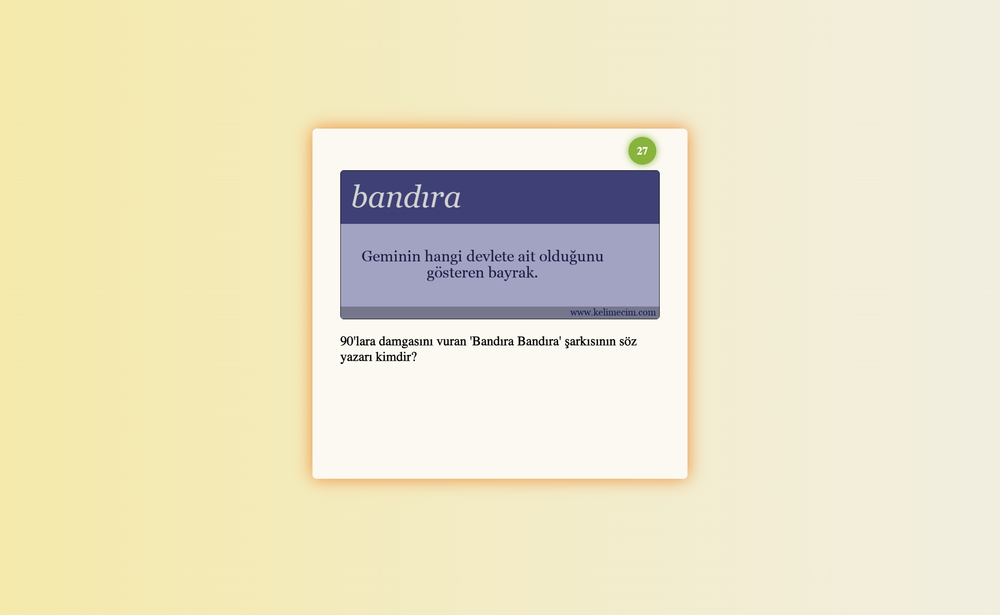
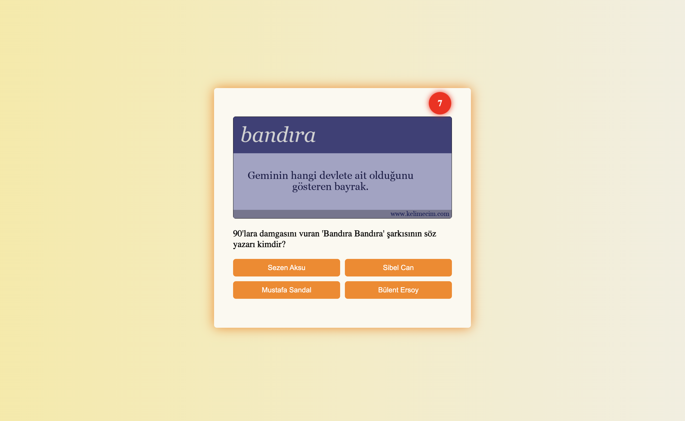
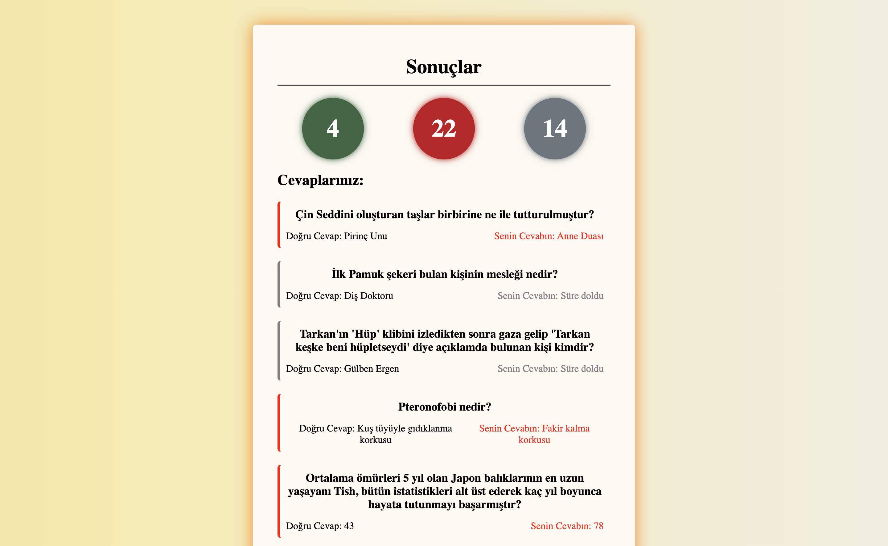
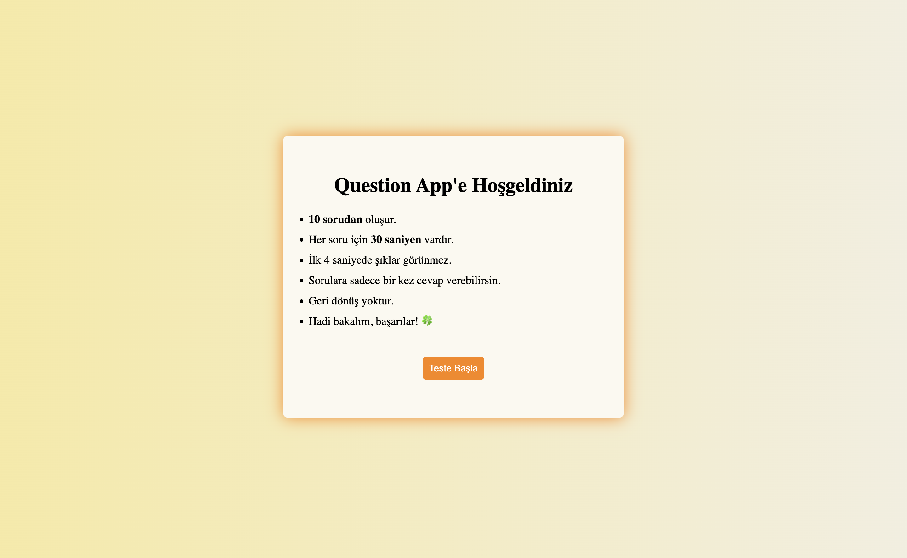

# ❓ Question App

Merhaba! Bu proje, temel React bilgileriyle geliştirdiğim interaktif bir **soru-cevap uygulamasıdır**. Kullanıcıların sorulara cevap verip sonuçları anında görebileceği, eğlenceli ve öğretici bir mini quiz sistemidir. 🎯

## 🚀 Projenin Amacı

Bu uygulama ile kullanıcılar:

- Sorulara verilen doğru / yanlış / boş cevap sayılarını görebilir 👀
- Her bir sorunun doğru cevabını öğrenebilir 🧠
- Kendi verdiği cevabı renkli olarak görsel şekilde karşılaştırabilir 🎨

## 🔧 Kullanılan Teknolojiler

| Teknoloji  | Açıklama                              |
| ---------- | ------------------------------------- |
| React      | Bileşen tabanlı arayüz geliştirme 🎈  |
| JavaScript | Mantıksal işlemler ve dinamik veri 🔢 |
| CSS        | Sayfa stil ve tasarımı 🎨             |
| Vite       | Geliştirme ortamı ve hızlı derleme ⚡ |

## 📸 Ekran Görüntüsü

Uygulamanın nasıl göründüğünü merak mı ettin? 👇






## 🔗 Canlı Demo

Projeyi canlı olarak incelemek istersen buraya tıkla:  
🌍 **[Canlı Demo Linki](https://question-app-ten-tau.vercel.app)**

## 📁 Kurulum

Projeyi kendi bilgisayarında çalıştırmak için şu adımları izleyebilirsin:

```bash
git clone https://github.com/kullanici-adin/question-app.git
cd question-app
npm install
npm run dev
```

# 📬 İletişim

Her türlü geri bildirim, öneri veya hata bildirimi için benimle iletişime geçebilirsiniz.
Ayrıca projeye katkı sağlamak ya da geliştirme sürecine dair tavsiyelerinizi paylaşmak isterseniz, mesajlarınızı memnuniyetle bekliyorum! 😊

📧 Mail: [tugceicigen0917@gmail.com]

💡 Proje ile ilgili beğendiğiniz veya geliştirilmesini istediğiniz yönleri belirtmeniz benim için çok değerli!
